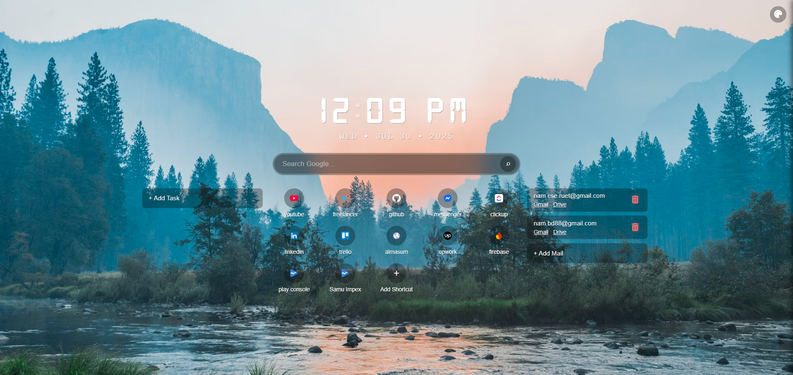
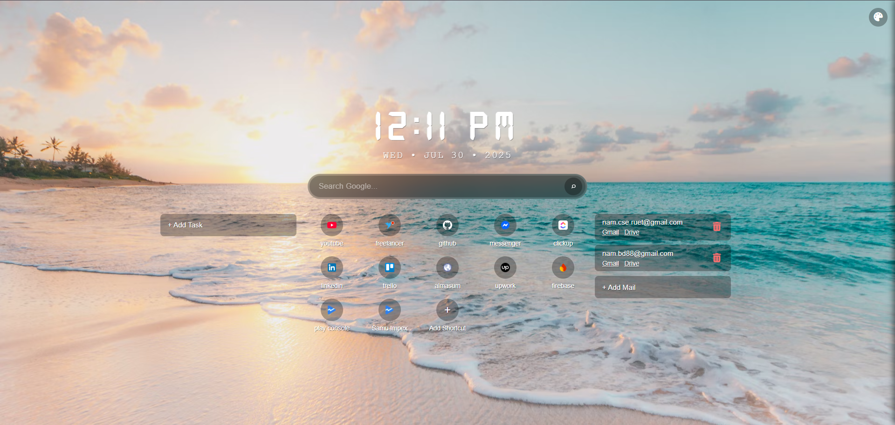
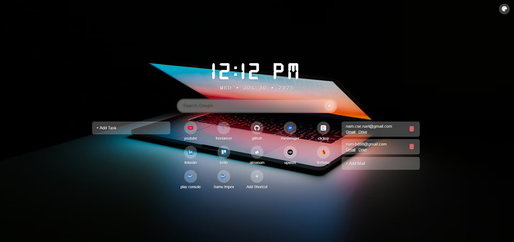
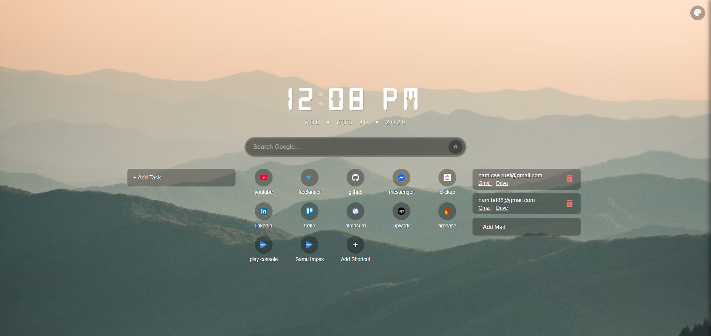

# Custom Chrome Tab Extension

A minimal and productive new tab experience for Chrome users. This extension provides a clean dashboard with real-time clock, Google search integration, daily task management, quick access shortcuts, and customizable website tiles.

## Preview

<table>
  <tr>
    <td></td>
    <td></td>
  </tr>
  <tr>
    <td></td>
    <td></td>
  </tr>
</table>


## Features

- **Live Digital Clock** - Real-time clock with automatic date updates
- **Google Search Integration** - Search directly from the new tab page
- **Daily Task Management** - Add, complete, and manage tasks that reset daily
- **Gmail & Drive Shortcuts** - Quick access to multiple accounts
- **Custom Website Shortcuts** - Add personalized tiles with favicon support
- **Responsive Design** - Optimized for desktop and mobile devices
- **Dark Theme Interface** - Modern, clean aesthetic

## Installation

### Option 1: Download ZIP

1. Click the **Code** button and select **Download ZIP**
2. Extract the downloaded file to a local directory
3. Open Chrome and navigate to `chrome://extensions/`
4. Enable **Developer mode** in the top-right corner
5. Click **Load unpacked** and select the extracted folder
6. Open a new tab to start using the extension

### Option 2: Clone Repository

```bash
git clone https://github.com/your-username/custom-chrome-tab.git
```

Follow steps 3-6 from Option 1 above.

## Using Mail Shortcuts

You can quickly access Gmail and Google Drive accounts using the mail shortcut section.

### What is the "ID"?

The ID refers to the account number used in Gmail URLs:

- https://mail.google.com/mail/u/0/#inbox → ID = 0 (first account)
- https://mail.google.com/mail/u/1/#inbox → ID = 1 (second account)

This number tells the shortcut which Google account to open.

### Steps to Add a Mail Shortcut

1. Click the "+ Add Mail" button
2. Enter:
   - ID: a number like 0, 1, 2 (based on your Google accounts)
   - Email: the Gmail address (just for display)
3. Click "Add"

Once added, the shortcut will show two links:
- Gmail → opens inbox for that ID
- Drive → opens Drive for that ID

Note: You must be logged in to that Google account in your browser for it to open correctly.

## Development

### Project Structure

```
project-root/
├── background/
│   └── background.js
├── fonts/
├── icons/
├── scripts/
│   ├── clock.js
│   ├── mail.js
│   ├── search.js
│   ├── shortcuts.js
│   ├── theme.js
│   └── todo.js
├── styles/
│   ├── base.css
│   ├── clock.css
│   ├── layout.css
│   ├── mail.css
│   ├── modal.css
│   ├── search.css
│   ├── shortcuts.css
│   ├── theme.css
│   └── todo.css
├── index.html
├── utils.js
└── manifest.json
```

### Technology Stack

- **JavaScript**: Vanilla ES6+ with modular architecture
- **CSS**: Grid and Flexbox for responsive layouts
- **Storage**: LocalStorage for client-side data persistence
- **Chrome APIs**: Extension-specific functionality

### Contributing

We welcome contributions to improve the extension. Consider these enhancement areas:

- AI-powered shortcut suggestions
- Weather widget integration
- Productivity analytics
- Cloud synchronization options
- Categorized shortcut organization

### Development Workflow

1. Fork the repository
2. Create a feature branch from main
3. Implement changes with appropriate testing
4. Submit a pull request with detailed description

## License

MIT License — Free for personal and commercial use. You may use, modify, and distribute this project without restriction. Attribution is appreciated but not required.